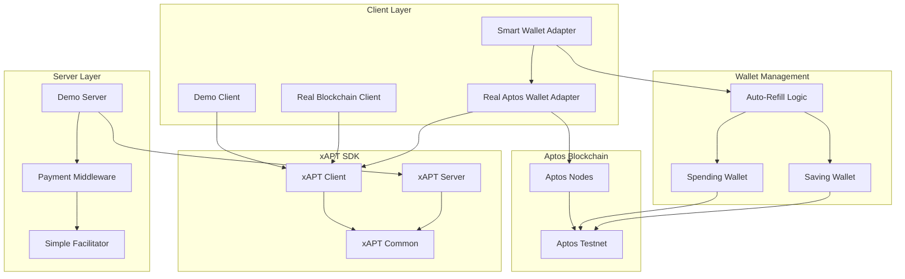
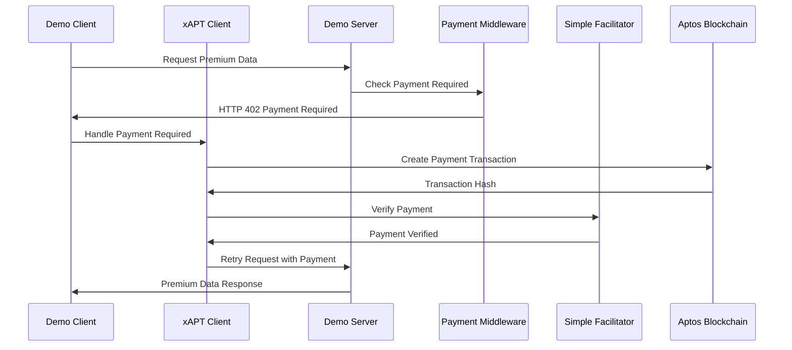
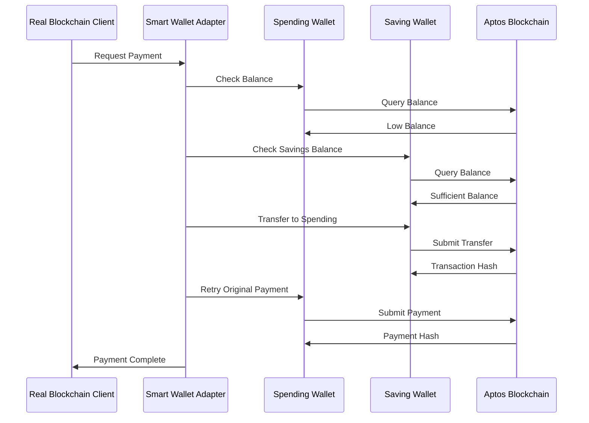

# xAPT Showcase Architecture

## Overview

The xAPT Showcase demonstrates a complete HTTP 402 Payment Required system using the Aptos blockchain. It implements a smart wallet with automatic refill functionality, real-time balance monitoring, and multiple payment tiers.

## System Architecture



## Component Breakdown

### 1. Client Layer

#### Demo Client (`DemoClient`)
- **Purpose**: Demonstrates basic xAPT SDK functionality
- **Features**: 
  - HTTP 402 Payment Required handling
  - Mock wallet integration
  - Payment flow demonstration

#### Real Blockchain Client (`RealBlockchainDemoClient`)
- **Purpose**: Demonstrates real blockchain transactions
- **Features**:
  - Real APT transfers on Aptos testnet
  - Smart wallet auto-refill functionality
  - Balance monitoring and alerts

#### Smart Wallet Adapter (`SmartWalletAdapter`)
- **Purpose**: Manages spending and saving wallets
- **Features**:
  - Automatic refill from savings when spending wallet is low
  - Daily refill limits and controls
  - Transaction history tracking
  - Balance monitoring

#### Real Aptos Wallet Adapter (`RealAptosWalletAdapter`)
- **Purpose**: Interfaces with real Aptos blockchain
- **Features**:
  - Real transaction signing and submission
  - Balance queries from blockchain
  - Sequence number management

### 2. xAPT SDK Layer

#### xAPT Client (`@xapt/client`)
- **Purpose**: Client-side payment handling
- **Features**:
  - HTTP 402 Payment Required response handling
  - Transaction creation and signing
  - Payment verification

#### xAPT Server (`@xapt/server`)
- **Purpose**: Server-side payment middleware
- **Features**:
  - Payment requirement enforcement
  - Transaction verification
  - Payment rule configuration

#### xAPT Common (`@xapt/common`)
- **Purpose**: Shared types and utilities
- **Features**:
  - TypeScript interfaces
  - Constants and configurations
  - Validation utilities

### 3. Server Layer

#### Demo Server (`DemoServer`)
- **Purpose**: Demonstrates server-side payment integration
- **Features**:
  - Multiple payment tiers (Public, Premium, Enterprise)
  - xAPT payment middleware integration
  - Real-time payment verification

#### Simple Facilitator (`SimpleFacilitator`)
- **Purpose**: Payment verification service
- **Features**:
  - Transaction verification endpoints
  - Payment validation logic
  - Health monitoring

#### Payment Middleware (`xaptPaymentMiddleware`)
- **Purpose**: Enforces payment requirements
- **Features**:
  - HTTP 402 responses
  - Payment rule configuration
  - Transaction verification

### 4. Blockchain Layer

#### Aptos Nodes
- **Purpose**: Blockchain interaction
- **Features**:
  - Transaction submission
  - Balance queries
  - State verification

#### Aptos Testnet
- **Purpose**: Testing environment
- **Features**:
  - Real APT tokens for testing
  - Transaction confirmation
  - Network synchronization

## Payment Flow



## Smart Wallet Auto-Refill Flow



## Key Features

### 1. HTTP 402 Payment Required
- **Implementation**: xAPT SDK handles 402 responses automatically
- **Flow**: Client receives 402 → Creates payment → Retries request
- **Benefits**: Seamless payment integration

### 2. Smart Wallet Auto-Refill
- **Implementation**: SmartWalletAdapter monitors balances
- **Triggers**: Low balance threshold, insufficient funds
- **Limits**: Daily refill count and amount limits
- **Benefits**: Automatic wallet management

### 3. Multiple Payment Tiers
- **Public**: No payment required
- **Premium**: 0.1 APT per request
- **Enterprise**: 0.5 APT per request
- **Subscription**: 0.1 APT per feed access

### 4. Real Blockchain Integration
- **Network**: Aptos Testnet
- **Token**: APT (8 decimals)
- **Transactions**: Real blockchain submissions
- **Verification**: On-chain transaction verification

### 5. Balance Monitoring
- **Real-time**: Live balance queries
- **Alerts**: Low balance warnings
- **History**: Transaction tracking
- **Statistics**: Daily refill metrics

## Configuration

### Payment Rules
```typescript
const paymentRules = {
  '/api/premium/data': {
    amount: '0.1',
    recipientAddress: '0x03aaf1fdf8525602baa4df875a4b76748b8e9fcd4502f2c28cf0d5caf3637a17',
    description: 'Premium market data access'
  }
};
```

### Smart Wallet Config
```typescript
const config = {
  lowBalanceThreshold: 0.2,    // 0.2 APT
  autoRefillAmount: 1.0,       // 1 APT
  maxRefillsPerDay: 5,
  maxDailyRefillAmount: 5.0,   // 5 APT
  enableAutoRefill: true,
  enableNotifications: true
};
```

## Usage Examples

### Basic Demo
```bash
npm run demo
```

### Real Blockchain Demo
```bash
npm run full-real-blockchain-demo
```

### Server Only
```bash
npm run server
```

### Client Only
```bash
npm run client
```

## Benefits

1. **Production Ready**: Real blockchain integration
2. **User Friendly**: Automatic wallet management
3. **Scalable**: Multiple payment tiers
4. **Secure**: On-chain verification
5. **Flexible**: Configurable payment rules
6. **Reliable**: Error handling and retry logic

This architecture demonstrates a complete HTTP 402 Payment Required system that can be used in production applications requiring blockchain-based payments. 