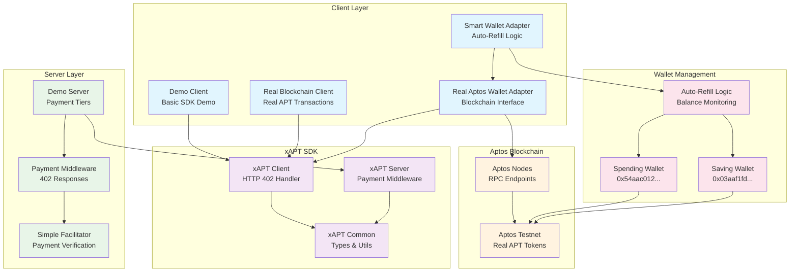
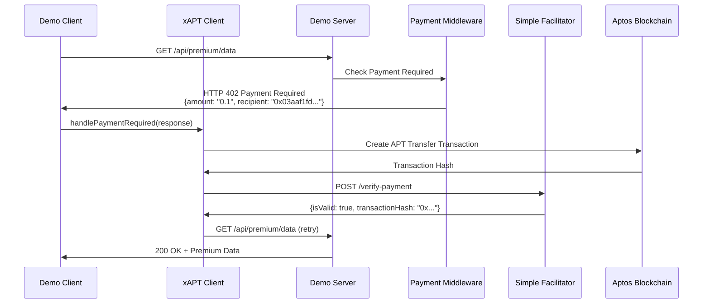
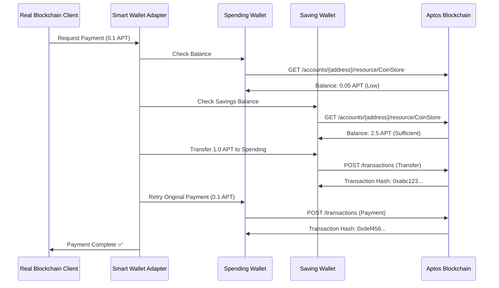
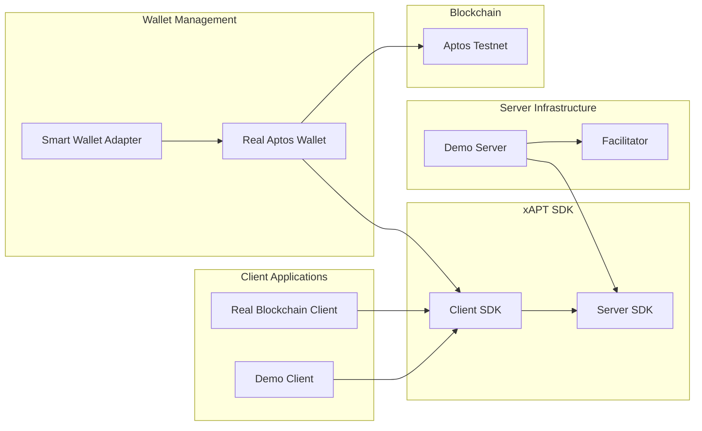
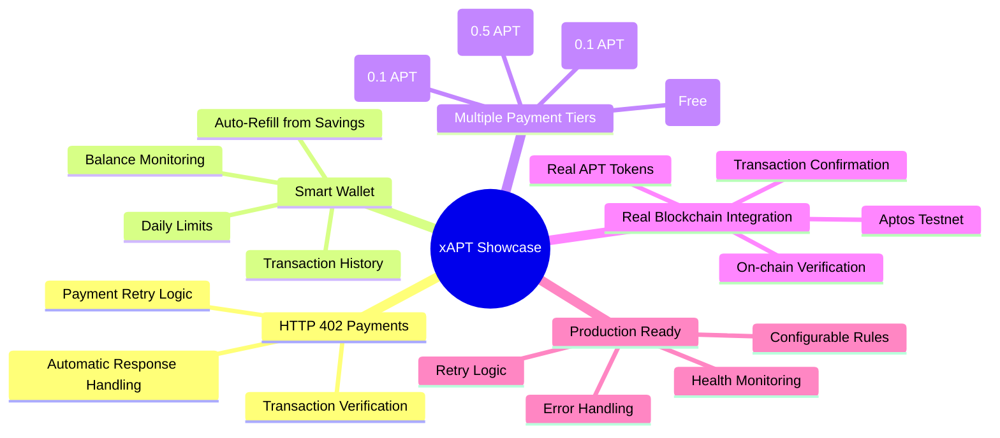
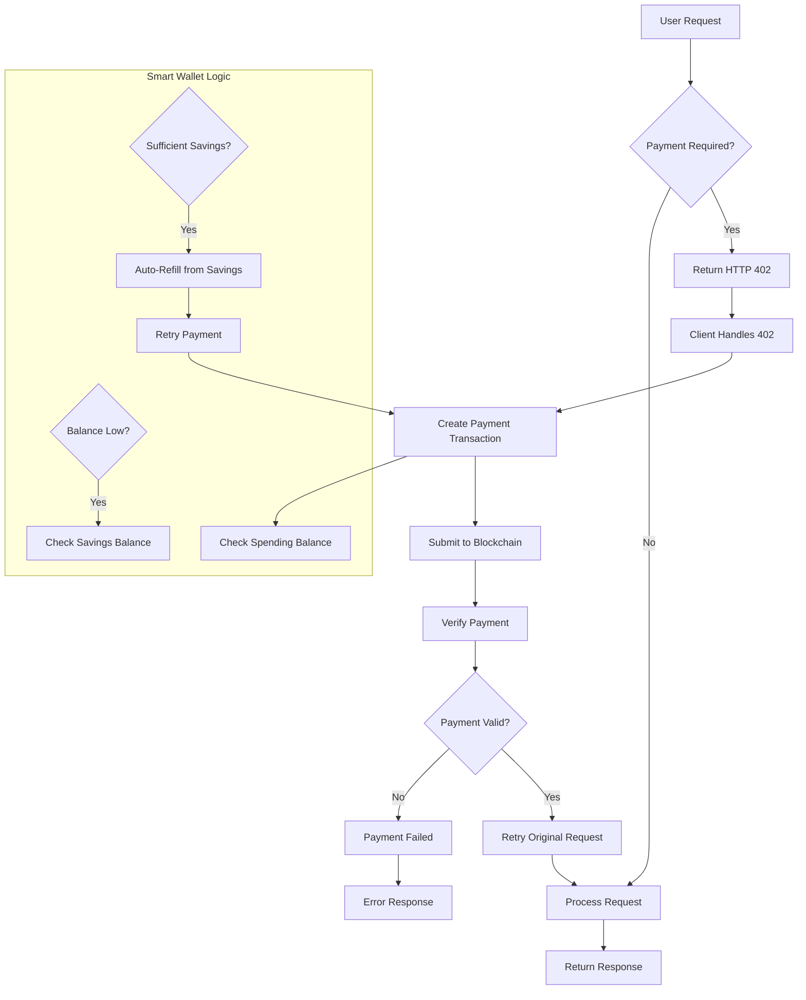

# xAPT Showcase Architecture Diagram

## System Overview

## Payment Flow Sequence

## Smart Wallet Auto-Refill Flow

## Component Relationships

## Key Features Overview

## Data Flow Architecture

This architecture demonstrates a complete HTTP 402 Payment Required system with smart wallet functionality, real blockchain integration, and production-ready features. 